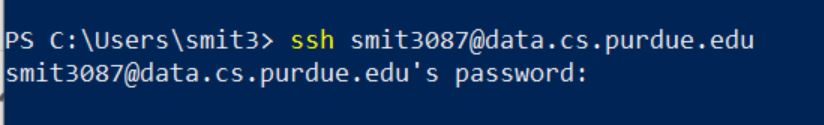
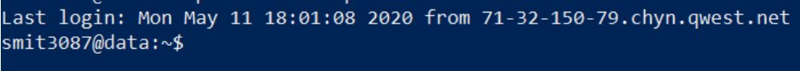
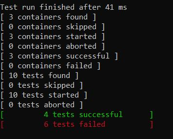
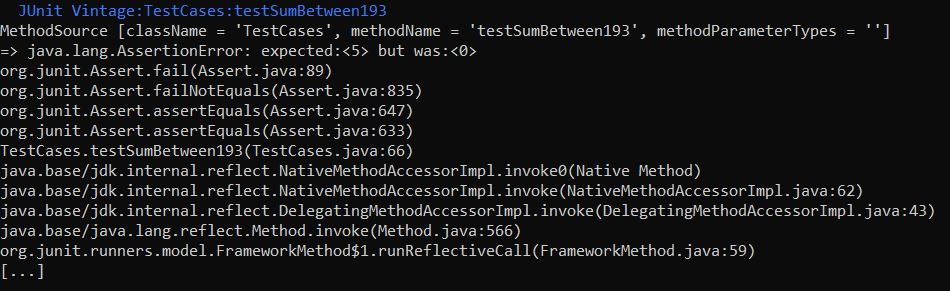

# Debugging: Command Line Instructions

## Step 1: Clone this repository
Open the command prompt on your local machine. If you are using your personal laptop, type the command:

**ssh your_purdue_username@data.cs.purdue.edu**

Into the command prompt. Hit enter to run the command. You will be presented with a password prompt:

Enter your Purdue password in the prompt. No text will appear after the prompt as you type; this is normal! Hit enter when you’re done, and if you’ve entered it incorrectly you’ll be prompted for a password again. If not, you’ll see something like this:

From here, you can create or navigate to a folder where you’d like to put the homework document using the mkdir or cd commands, respectively. Once you’ve reached a place in your directory where you’d like to put the homework, run the command:

**git clone https://github.com/Purdue-CS193/homework-2-<your_GitHub_username>.git**

You can also copy the clone link from the green button at the top of this repo that says 'Code'. If the clone is successful, you’ll see the following:

And if you run the command **ls**, you should see a directory called homework-2-<your_github_username>. Cd into that directory using the command **cd homework-2-<your_github_username>**. Run **ls** in that directory and you’ll see multiple files and subdirectories. The **README** file contains the instructions for this assignment. The **src** subdirectory contains all of the Java files you’ll need to edit/debug for this assignment. Navigate to this directory using **cd src** and inspect the java files using whichever text editor you prefer (nano, vim, etc). The **Questions.java** file is the one you’ll be editing; the **TestCases.java** file contains code to test the code you edit.

## Step 2: Running and debugging JUnit testcases
Download the file named ‘junit-platform-console-standalone-1.7.0-M1.jar’ at the link [here](https://repo1.maven.org/maven2/org/junit/platform/junit-platform-console-standalone/1.7.0-M1/junit-platform-console-standalone-1.7.0-M1.jar).

To compile the test cases, the file you just downloaded must be located in the same repository where the test cases are found. To do this, you’ll need to access the file on your local machine and send it to your remote machine.

If you ssh’d into a remote machine via your local command line, run the command **exit** with no arguments to exit to your local machine. 

If you’ve ssh’d via a tool (like PuTTY) instead of your command line, open your command line (Powershell or Command Prompt on Windows, and Terminal on macOS/Linux).

Once you’ve accessed your local computer’s command line, you need to copy the downloaded file to your remote machine. To get the file from your local to your remote computer, run the command:

**scp local_filepath your-purdue-username@data.cs.purdue.edu:your_testcase_filepath**

For instance, if your local file is stored in your Downloads folder, the local file path would be **Downloads/junit-platform-console-standalone-1.7.0-M1.jar**. Your test cases will be located at **CS193HW2/src**. If you’ve cloned the repo into a subdirectory, make sure to include the full path name, starting from your home directory. 

If the scp command has run correctly, you will be prompted to login to your account on the data server (just like when you ssh’d!). After logging in, the file should be copied to the **src** directory which contains your test cases. Navigate to that directory and run ‘ls’ to ensure that the file exists in the correct location.

Once the file is in the correct location, run the **run.sh** script (run **./run.sh**) to compile and run the test cases.

Note: if you get an error that says "Permission denied" when running run.sh, run the following command:

**chmod +x run.sh**

Then try again. After running this command, you should not have to run it again.

The output may look confusing, but the most important information is located at the bottom. It should look something like:

The bottom two lines show the number of tests succeeded and failed. **run.sh** will highlight these in green and red, respectively. Please keep in mind that some of these test cases are for the extra credit portion of the assignment, so make sure that you are passing the necessary test cases. If you decide not to do the extra credit, the failed tests will still be highlighted red, but it will not count against you.

To further inspect how each test has behaved, scroll up:

This output exists for each test. The first line displays the name of the test, and the third line shows the expected and the actual output. In the example above, the expected output was 5 (expected:<5>), while the actual output was 0 (was:<0>). **run.sh** will highlight each individual test in blue.

You can use the output above to logically debug your code (think about what the errors are), or you can use resources given below to debug failed tests.

## Step 3: Fix those bugs
You can use print statement debugging by manually editing the **Questions.java** file and adding print statements. Use whichever text editor you’re most familiar with.

You can also use the Java command-line debugger, JDB, to debug by setting breakpoints and inspecting variables as you step through your code. There is a link below to JDB documentation, which will guide you through it’s usage.
You might also want to try to understand the algorithms, such as binary search, as they commonly show up in technical interviews (although you're not required to do this). **You are NOT allowed to make any changes to the test case file. If you feel there is a need to make changes, please email your TA or post on Piazza. It will be an automatic 0 if changes are made!**

You may continue to use run.sh to check your solutions until you get the correct answers.

[Click here for JDB Documentation!](https://www.tutorialspoint.com/jdb/jdb_syntax.htm)

## Step 4: Push your changes to GitHub!
When you’re ready to push your changes to your main repository (GitHub), navigate to your **src** directory, or whichever directory contains your **TestCases** and **Questions** files. Run the command **git add .** to stage all of your changes before committing - DO NOT FORGET the period at the end! If you want to ensure all the changed files have been staged, you can run **git status** to see the status of the added files. 

After staging the files, run **git commit -m “Your commit message here”**, and include your unique, descriptive commit message between the quotes of the final argument. PSA: Your TAs and instructors can see your commit messages.
After committing the files, run the command **git push origin your-branch**, where **your-branch** is the name of the branch you’re currently on. To verify your current branch name, run the command **git branch** - this will list all of the branches, and your current branch will be marked with a *.

As with every other homework, if your code isn't on GitHub we won't be able to grade it! Once you're happy with the fixes you've made to the code (likely when all the test cases pass), push your work to GitHub. You can push as many times as you like before the homework is due - just make sure that the final version you push is your best work!

