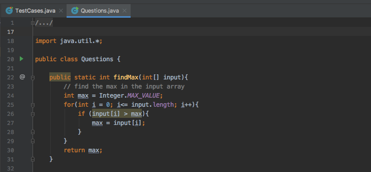
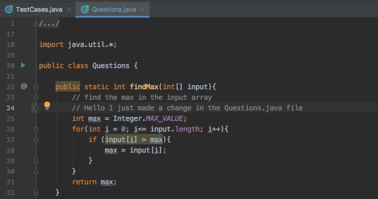
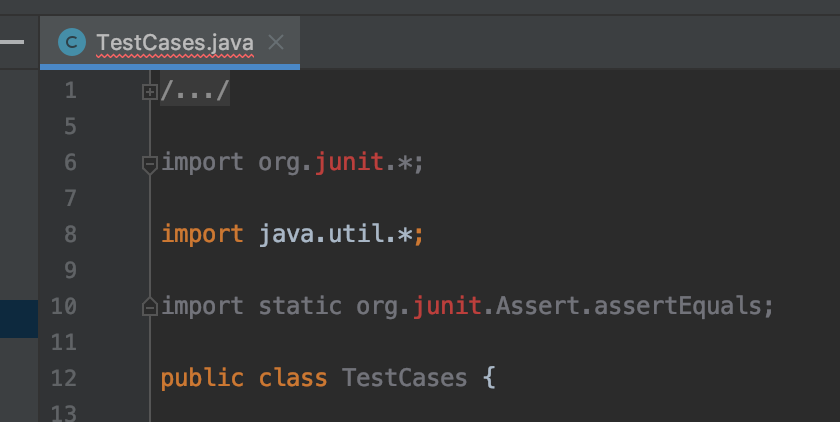
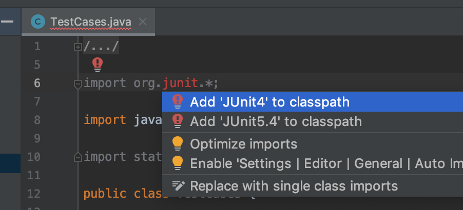
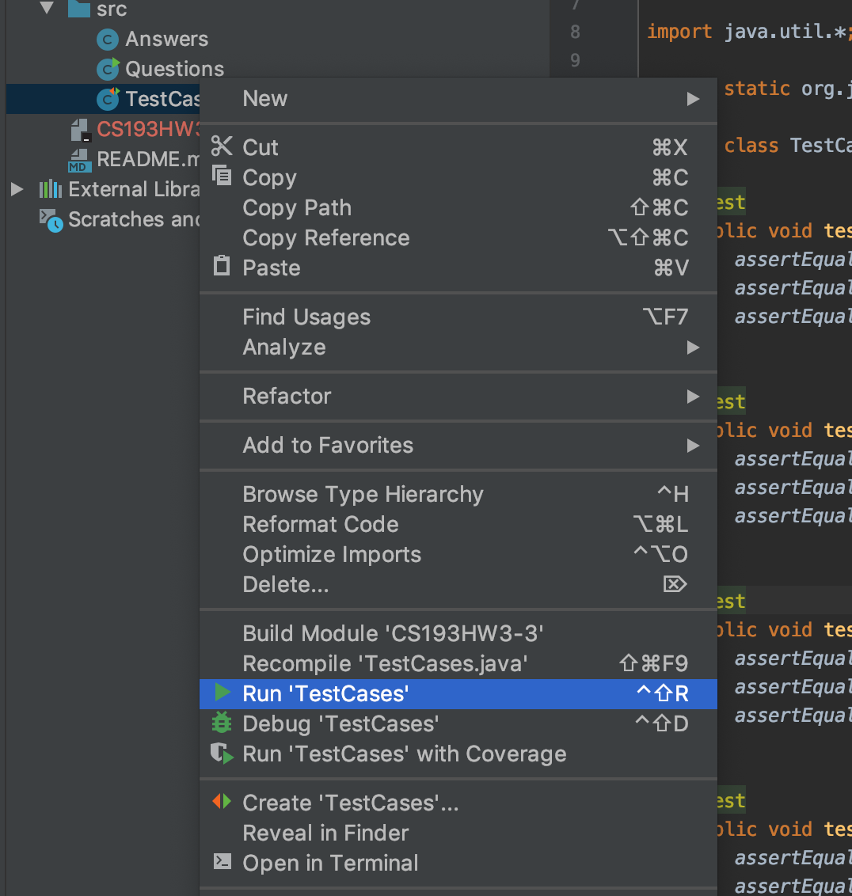
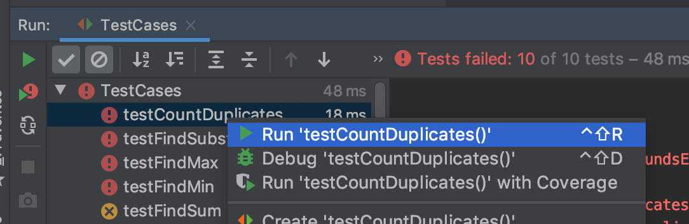
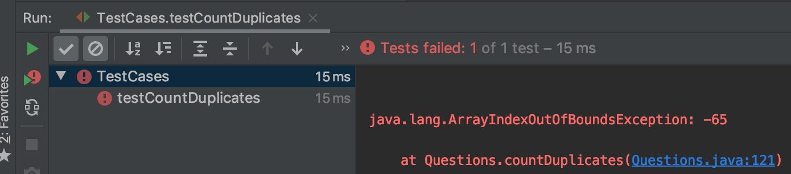
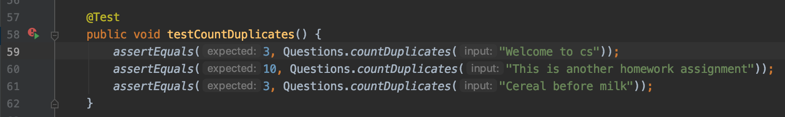
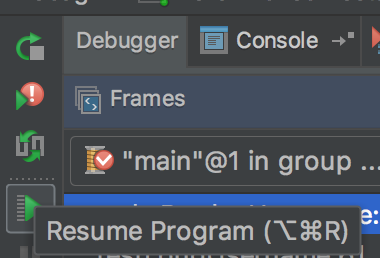

# CS193HW2: Debugging 

## What is this assignment
As you heard from lecture, debugging is a very useful and necessary tool for developing software and solving problems. In this homework assignment you will be tasked with fixing errors in serveral methods. Each method solves a different problem such as finding the minimum in an array or running a binary search. The algorithm for each problem will be given, but there are small bugs littered in the code preventing the test cases from passing. 

## When is this due?
This homework will be due on **10/2/2020**.

## When will I know I'm done?
You will know that you have finished when all the test cases pass and your code is visible on GitHub. There will be hidden test cases that checks for any hardcoded solutions.

## The Scenario
Picture this: You land a great internship as a Freshman thanks to all the skills you learned in CS193, and are put to the task of picking up where last year's IU intern left off.

Needless to say, they've left a mess of things. It's up to you to identify what's wrong with their code!

## Step 1: Clone this repository
Without getting too deep into the commands of git, we want to "clone" our repository and edit it locally
like any other file (if you are interested, [check out this guide](http://rogerdudler.github.io/git-guide/)) 

IntelliJ has a great deal of support for exactly this! We can store a local version of our repository, and 
push any changes to the remote repo easily!

### How to clone remote repo to local repo and manage it with IntelliJ

1. Close any projects you currently have open

`File` -> `Close Project`

You should now see the main IntelliJ screen (It looks like the picture below).

**NOTE: If you just clone without letting IntelliJ configure everything for you, it's a pain in the butt to fix. Please let IntelliJ create everything for you!**

2. Checkout a project from Version Control.  This is done from the welcome screen in Intellij!
 

Click `Check out from Version Control` -> `Git` -> `Log in to GitHub...`

3. Click 'Clone'

4. Enter your GitHub credentials if asked for. (Note: The order of steps 3 and 4 might be flipped)

5. Confirm checkout from version control. Click 'yes'

6. IntelliJ will now ask you if you want to customize setup or rely on the default. You can just click 'Yes' or 'Confirm' on the screens that follow

7. Make some changes to the documents

)

## Step 2: Running and debugging JUnit testcases
1.  Configure IntelliJ for JUnit

You just need to hit ALT + ENTER and choose "Add JUnit4 to classpath". ALT + ENTER is your friend in IntelliJ :)

2.  Run all the test cases

You can run all test cases by right clicking the test case file.

##### Note on test case results:
-  is good, because you passed all checks
-  means you got a wrong result in a test case
-  means an exception was encountered when running the case

3) Run a particular test case

You can also isolate a single test case and run only that one by right-clicking it.

This results in:

4) Find the line where it goes wrong

Once the test case fails, you can pinpoint the exact issue by double-clicking the failed
case. This will show you either the assert statement you got incorrect, or the line where
an exception was encountered.

5) Set method and line breakpoints and start test case in Debug mode

Set some breakpoints in the methods you suspect this test case has 
touched, and then run the test case in Debug mode.

6) Continue stepping through the code and find the issue

You can see the step-by-step execution of your code, as well as the values of variables
and how they change.

To move onto the next breakpoint sector, you have to resume the program.

7) Take advantage of the information you find, and just keep stepping!

## Step 3: Fix those bugs
Use print statements, the debugger, or any strategy you'd like to fix the bugs in the methods and pass the test cases. You might also want to try to understand the algorithms, such as binary search, as they commonly show up in technical interviews (although you're not required to do this). 
**You are NOT allowed to make any changes to the testcase file. If you feel there is a need to make changes, please email your TA or post on Piazza. It will be an automatic 0 if changes are made**

[Click here for Intellij's debugger documentation](https://www.jetbrains.com/help/idea/debugging-code.html)

## Step 4: Push your changes to GitHub!
1. Commit and push your changes. **Note: Depending on version, the pull and commit may look like blue and green arrows instead.** 

2. Confirm you'd like to push changes

#### NOTE: Each time you open this project, you should PULL to make sure your local repository is up to date with the remote repository

As with every other homework, if your code isn't on GitHub we won't be able to grade it!  Once you're happy with the fixes you've made to the code (likely when all the test cases pass), save your work to GitHub.

## Rubric
The last 4 questions will be extra credit totalling up to 5 extra credit points!! We encourage you all to try it out. 

| Task    | Points |
| ------- | ------ |
| Task 1  | 2      |
| Task 2  | 2      |
| Task 3  | 3      |
| Task 4  | 3      |
| Task 5  | 5      |
| Task 6  | 5      |
| Task 7  | 2(EC)  |
| Task 8  | 1(EC)  |
| Task 9  | 1(EC)  |
| Task 10 | 1(EC)   |
| Total   | 20     |

## Reminder
As always, feel free to ask questions on piazza, in pso, and/or office hours. Good luck!
